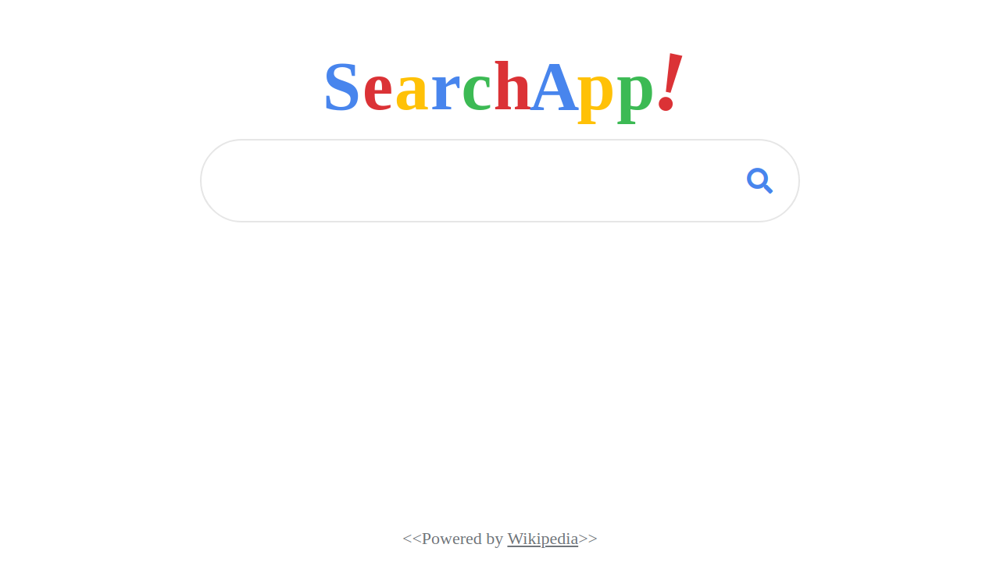
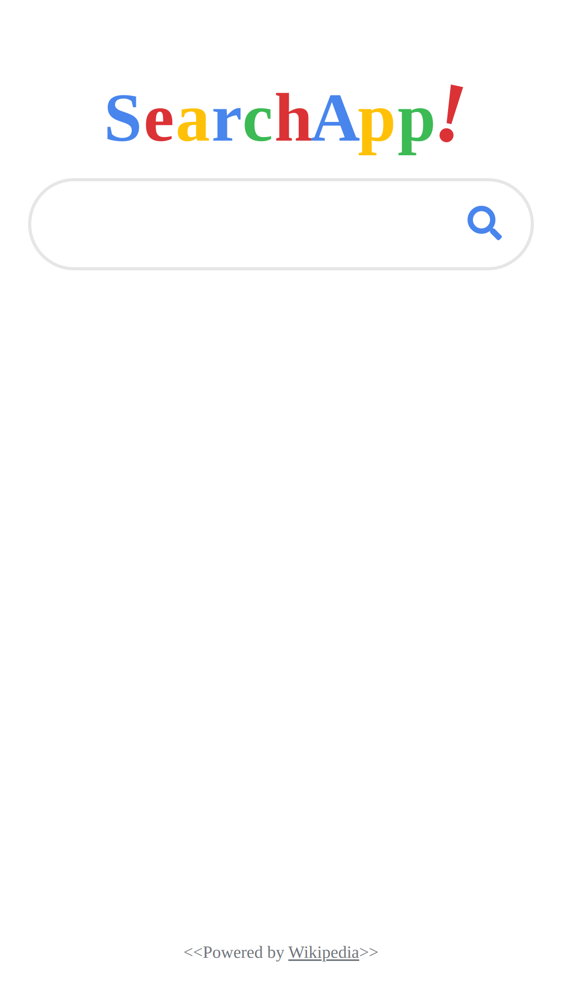

# SearchApp

## Descripción

Código de la aplicación searchapp hecha en html, css, scss y javascript que utiliza la API de wikipedia.

---

## Vista En Versión Desktop

## Vista En Versión Mobile

---

## Enlace A La Aplicación

- [Search App](https://axe10rellana.github.io/searchapp/searchapp/)

---

## Autor

- Website - [Axe10rellana](https://axe10rellana.github.io/portafolio/portafolio/)
